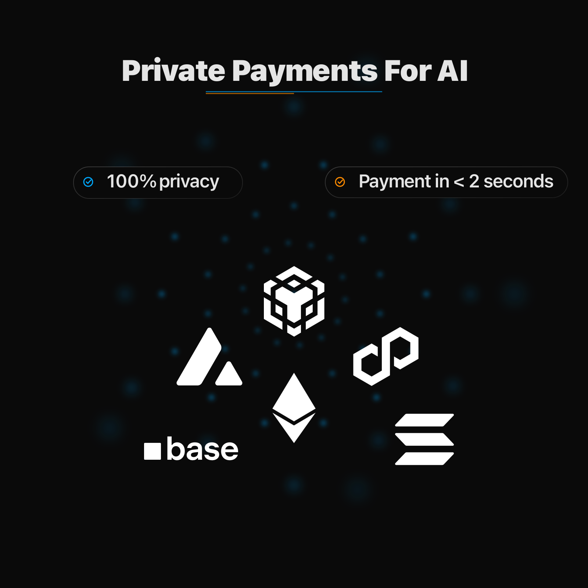
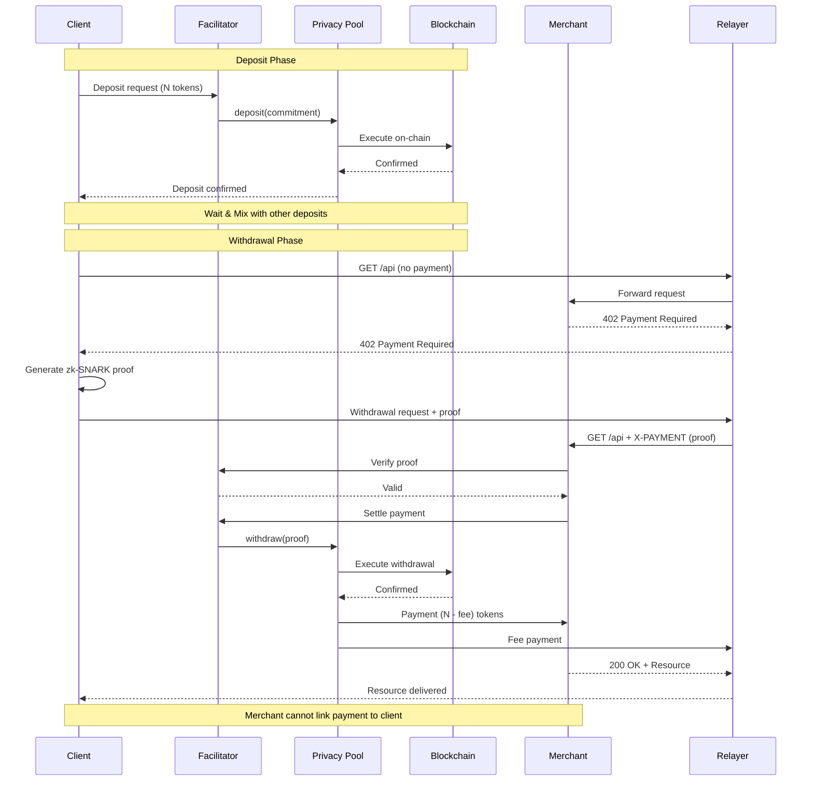

# Welcome to torx402

<figure></figure>

## What is torx402?

**torx402** is a privacy-preserving payment protocol that brings **anonymous micropayments** to plain HTTP. By combining the [x402 protocol](https://x402.org) with [Tornado Cash](https://tornado.ws/)'s zero-knowledge privacy technology, torx402 enables truly private, instant, and low-cost payments for web APIs, digital content, and AI agent commerce.

With torx402, **clients can pay for resources without revealing their identity**, and **merchants can receive payments without knowing who paid**—all while maintaining cryptographic proof of payment validity.

## The Problem

Traditional payment systems and even standard blockchain transactions reveal sensitive information:

- 🔍 **Transaction Trails**: Every payment is publicly linked to sender and recipient addresses
- 👁️ **Usage Patterns**: API consumption patterns can reveal business strategies and competitive intelligence
- 🤖 **Agent Privacy**: AI agents operating autonomously expose their decision-making patterns
- 💼 **Commercial Sensitivity**: B2B API usage reveals partnerships, vendor relationships, and operational data
- 🌐 **Web2 Privacy Loss**: Current micropayment solutions sacrifice the privacy users expect from traditional web services

## The Solution

torx402 solves these problems by combining:

### 🌐 **x402 Protocol**
HTTP-native micropayments using the `402 Payment Required` status code
- Pay-per-request pricing
- No accounts or API keys required
- Universal HTTP compatibility
- Sub-second settlement

### 🌪️ **Tornado Cash Technology**
Zero-knowledge privacy through zk-SNARKs
- Deposit-withdrawal unlinkability
- Cryptographic anonymity sets
- Front-running protection
- No trusted third parties

### 🔒 **Result: Private Micropayments**
Anonymous, instant, verifiable payments over HTTP
- Pay anonymously for any API or service
- Receive payments without knowing the payer
- Maintain cryptographic proof of payment
- Preserve commercial confidentiality

## How It Works (Simple Version)

## Use Cases

### 🤖 **Anonymous AI Agent Commerce**
AI agents can purchase API access, data feeds, and services without revealing their operational patterns or strategies.

### 📊 **Confidential API Monetization**
API providers can monetize endpoints while protecting customer privacy and preventing competitive intelligence gathering.

### 📝 **Private Content Access**
Users can pay for articles, reports, and premium content without creating accounts or revealing browsing patterns.

### 🏢 **B2B Anonymous Payments**
Companies can pay for vendor APIs without revealing usage patterns, integration strategies, or business relationships.

### 🌐 **DePIN & IoT Micropayments**
IoT devices can make machine-to-machine payments for bandwidth, compute, or data without exposing device identity or location patterns.

## Why torx402?

| Feature | Traditional Payment | Standard x402 | torx402 |
|---------|-------------------|---------------|-------------|
| **Transaction Speed** | Minutes to days | <1 second | <1 second* |
| **Sender Privacy** | ❌ Exposed | ❌ Exposed | ✅ Anonymous |
| **Recipient Privacy** | ❌ Exposed | ❌ Exposed | ✅ Protected |
| **Usage Pattern Privacy** | ❌ Fully visible | ❌ Fully visible | ✅ Hidden |
| **No Accounts Required** | ❌ Required | ✅ Not required | ✅ Not required |
| **Merchant Fees** | ❌ High (2-3%) | ✅ Zero | ✅ Zero |
| **Micropayment Friendly** | ❌ Too expensive | ✅ Optimized | ✅ Optimized |
| **Agent Compatible** | ⚠️ Limited | ✅ Yes | ✅ Yes |
| **Cryptographic Privacy** | ❌ None | ❌ None | ✅ zk-SNARKs |

*<1 second when high volume transactions are processed.

## Community & Support

- 🌐 **Website**: [https://torx402.network](https://torx402.network)
- 🐦 **Twitter**: [@torx402](https://twitter.com/torx402)
- 📖 **Documentation**: You're reading it!
- 💻 **GitHub**: [github.com/torx402](https://github.com/torx402)

## Security

torx402 is built on top of the battle-tested Tornado.cash protocol and inherits security properties from both x402 and Tornado Cash. Our implementation has been designed with security as the top priority:

- ✅ Zero-knowledge proof verification
- ✅ Replay attack prevention
- ✅ Double-spending prevention
- ✅ 126-bit cryptographic security

**Security Notice**: torx402 is currently in beta. Smart contracts are undergoing professional security audits. Use at your own risk and only with amounts you can afford to lose.

## License

torx402 is open-source software licensed under [MIT License](LICENSE).

## Contributing

We welcome contributions from the community! Whether it's:

- 🐛 Bug reports
- 💡 Feature suggestions
- 📝 Documentation improvements
- 💻 Code contributions

Check out our [Contributing Guide](contributing/how-to-contribute.md) to get started.

---

  
<strong>Built with ❤️ for a more private web3</strong>

  

    <a href="introduction/what-is-torx402.md">Learn More</a> •

    <a href="protocol/overview.md">Protocol Spec</a> •
    <a href="resources/api-reference.md">API Docs</a>
  

