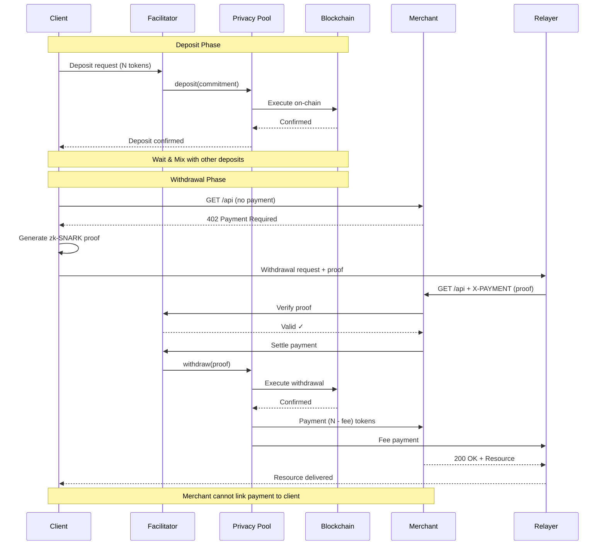

# Welcome to torx402

<figure><figcaption>
Privacy-preserving HTTP micropayments powered by zero-knowledge proofs
</figcaption></figure>

## What is torx402?

**torx402** is a privacy-preserving payment protocol that brings **anonymous micropayments** to plain HTTP. By combining the [x402 protocol](https://x402.org) with [Tornado Cash](https://tornado.ws/)'s zero-knowledge privacy technology, torx402 enables truly private, instant, and low-cost payments for web APIs, digital content, and AI agent commerce.

With torx402, **clients can pay for resources without revealing their identity**, and **merchants can receive payments without knowing who paid**—all while maintaining cryptographic proof of payment validity.

## The Problem

Traditional payment systems and even standard blockchain transactions reveal sensitive information:

- 🔍 **Transaction Trails**: Every payment is publicly linked to sender and recipient addresses
- 👁️ **Usage Patterns**: API consumption patterns can reveal business strategies and competitive intelligence
- 🤖 **Agent Privacy**: AI agents operating autonomously expose their decision-making patterns
- 💼 **Commercial Sensitivity**: B2B API usage reveals partnerships, vendor relationships, and operational data
- 🌐 **Web2 Privacy Loss**: Current micropayment solutions sacrifice the privacy users expect from traditional web services

## The Solution

torx402 solves these problems by combining:

### 🌐 **x402 Protocol**
HTTP-native micropayments using the `402 Payment Required` status code
- Pay-per-request pricing
- No accounts or API keys required
- Universal HTTP compatibility
- Sub-second settlement

### 🌪️ **Tornado Cash Technology**
Zero-knowledge privacy through zk-SNARKs
- Deposit-withdrawal unlinkability
- Cryptographic anonymity sets
- Front-running protection
- No trusted third parties

### 🔒 **Result: Private Micropayments**
Anonymous, instant, verifiable payments over HTTP
- Pay anonymously for any API or service
- Receive payments without knowing the payer
- Maintain cryptographic proof of payment
- Preserve commercial confidentiality

## Key Features

✅ **Privacy-First**: Zero-knowledge proofs ensure complete anonymity between deposits and withdrawals

✅ **HTTP-Native**: Works with any HTTP API—no special client requirements beyond torx402 support

✅ **Instant Settlement**: Payments settle in <1 second with blockchain finality

✅ **No Fees for Merchants**: Payers cover all network fees through the relayer system

✅ **Agent-Ready**: Perfect for AI agents that need to transact autonomously without revealing strategies

✅ **Multi-Chain**: Supports EVM chains (Base, Avalanche, Polygon, etc.) and Solana

✅ **Denomination Pools**: Fixed-amount pools maximize anonymity sets

✅ **Relayer Network**: Optional relayers enable truly anonymous withdrawals with no on-chain connection

## How It Works (Simple Version)

```mermaid
sequenceDiagram
    participant Client
    participant Facilitator
    participant Pool as Privacy Pool
    participant Blockchain
    participant Merchant
    participant Relayer

    Note over Client,Blockchain: Deposit Phase
    Client->>Facilitator: Deposit request (N tokens)
    Facilitator->>Pool: deposit(commitment)
    Pool->>Blockchain: Execute on-chain
    Blockchain-->>Pool: Confirmed
    Pool-->>Client: Deposit confirmed

    Note over Client,Blockchain: Wait & Mix with other deposits

    Note over Client,Blockchain: Withdrawal Phase
    Client->>Merchant: GET /api (no payment)
    Merchant-->>Client: 402 Payment Required
    Client->>Client: Generate zk-SNARK proof
    Client->>Relayer: Withdrawal request + proof
    Relayer->>Merchant: GET /api + X-PAYMENT (proof)
    Merchant->>Facilitator: Verify proof
    Facilitator-->>Merchant: Valid ✓
    Merchant->>Facilitator: Settle payment
    Facilitator->>Pool: withdraw(proof)
    Pool->>Blockchain: Execute withdrawal
    Blockchain-->>Pool: Confirmed
    Pool->>Merchant: Payment (N - fee) tokens
    Pool->>Relayer: Fee payment
    Merchant-->>Relayer: 200 OK + Resource
    Relayer-->>Client: Resource delivered

    Note over Client,Merchant: Merchant cannot link payment to client
```

### Step-by-Step:

1. **Deposit**: Client deposits fixed amount (e.g., 0.1 ETH) into a privacy pool with a secret commitment
2. **Mix**: Deposit mixes with other users' deposits in the anonymity set
3. **Request**: Client requests a protected resource from a merchant server
4. **Payment Required**: Server responds with `402 Payment Required`
5. **Proof Generation**: Client generates a zero-knowledge proof of deposit ownership
6. **Anonymous Withdrawal**: Client (via relayer) withdraws payment to merchant without revealing which deposit
7. **Verification**: Merchant verifies the proof and receives payment
8. **Resource Delivery**: Merchant delivers the requested resource

**Privacy Guarantee**: The merchant knows they received valid payment, but cannot determine which deposit it came from.

## Use Cases

### 🤖 **Anonymous AI Agent Commerce**
AI agents can purchase API access, data feeds, and services without revealing their operational patterns or strategies.

### 📊 **Confidential API Monetization**
API providers can monetize endpoints while protecting customer privacy and preventing competitive intelligence gathering.

### 📝 **Private Content Access**
Users can pay for articles, reports, and premium content without creating accounts or revealing browsing patterns.

### 🏢 **B2B Anonymous Payments**
Companies can pay for vendor APIs without revealing usage patterns, integration strategies, or business relationships.

### 🌐 **DePIN & IoT Micropayments**
IoT devices can make machine-to-machine payments for bandwidth, compute, or data without exposing device identity or location patterns.

## Getting Started

Ready to integrate privacy-preserving payments into your application?

<table data-view="cards">
  <thead>
    <tr>
      <th></th>
      <th></th>
      <th data-hidden data-card-target data-type="content-ref"></th>
    </tr>
  </thead>
  <tbody>
    <tr>
      <td><strong>Quick Start</strong></td>
      <td>Get up and running in 5 minutes</td>
      <td><a href="introduction/quick-start.md">quick-start.md</a></td>
    </tr>
    <tr>
      <td><strong>Core Concepts</strong></td>
      <td>Understand how torx402 works</td>
      <td><a href="core-concepts/privacy-in-micropayments.md">privacy-in-micropayments.md</a></td>
    </tr>
    <tr>
      <td><strong>For Merchants</strong></td>
      <td>Accept anonymous payments in your API</td>
      <td><a href="implementation/servers/setup.md">setup.md</a></td>
    </tr>
    <tr>
      <td><strong>For Clients</strong></td>
      <td>Make anonymous payments for services</td>
      <td><a href="implementation/clients/setup.md">setup.md</a></td>
    </tr>
  </tbody>
</table>

## Why torx402?

| Feature | Traditional Payment | Standard x402 | torx402 |
|---------|-------------------|---------------|-------------|
| **Transaction Speed** | Minutes to days | <1 second | <1 second |
| **Sender Privacy** | ❌ Exposed | ❌ Exposed | ✅ Anonymous |
| **Recipient Privacy** | ❌ Exposed | ❌ Exposed | ✅ Protected |
| **Usage Pattern Privacy** | ❌ Fully visible | ❌ Fully visible | ✅ Hidden |
| **No Accounts Required** | ❌ Required | ✅ Not required | ✅ Not required |
| **Merchant Fees** | ❌ High (2-3%) | ✅ Zero | ✅ Zero |
| **Micropayment Friendly** | ❌ Too expensive | ✅ Optimized | ✅ Optimized |
| **Agent Compatible** | ⚠️ Limited | ✅ Yes | ✅ Yes |
| **Cryptographic Privacy** | ❌ None | ❌ None | ✅ zk-SNARKs |

## Community & Support

- 🌐 **Website**: [https://torx402.network](https://torx402.network)
- 💬 **Discord**: [Join our community](https://discord.gg/torx402)
- 🐦 **Twitter**: [@torx402](https://twitter.com/torx402)
- 📖 **Documentation**: You're reading it!
- 💻 **GitHub**: [github.com/torx402](https://github.com/torx402)

## Security & Audits

torx402 inherits security properties from both x402 and Tornado Cash protocols. Our implementation has been designed with security as the top priority:

- ✅ Zero-knowledge proof verification
- ✅ Replay attack prevention
- ✅ Front-running protection
- ✅ Double-spending prevention
- ✅ 126-bit cryptographic security


**Security Notice**: torx402 is currently in beta. Smart contracts are undergoing professional security audits. Use at your own risk and only with amounts you can afford to lose.


## License

torx402 is open-source software licensed under [MIT License](LICENSE).

## Contributing

We welcome contributions from the community! Whether it's:

- 🐛 Bug reports
- 💡 Feature suggestions
- 📝 Documentation improvements
- 💻 Code contributions
- 🎨 UI/UX enhancements

Check out our [Contributing Guide](contributing/how-to-contribute.md) to get started.

---

  
<strong>Built with ❤️ for a more private web</strong>

  

    <a href="introduction/what-is-torx402.md">Learn More</a> •
    <a href="introduction/quick-start.md">Quick Start</a> •
    <a href="protocol/overview.md">Protocol Spec</a> •
    <a href="resources/api-reference.md">API Docs</a>
  

