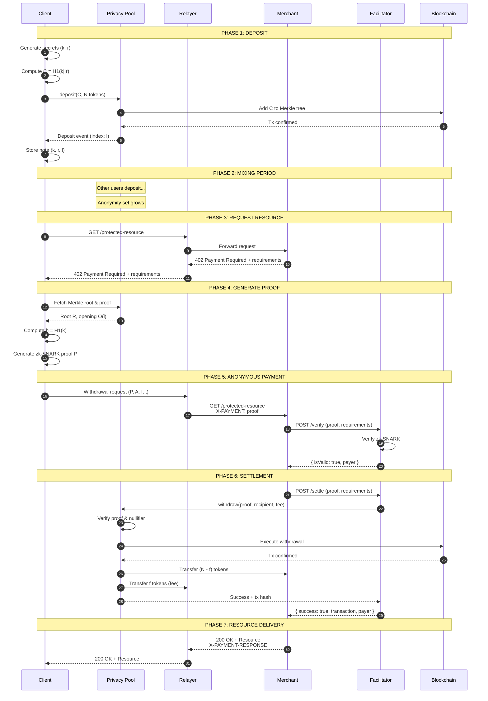

# Payment Flow

## Overview

The torx402 payment flow combines privacy-preserving deposits with HTTP-native micropayments. This page details the complete flow from initial deposit through anonymous payment and resource delivery.

## Complete Payment Flow Diagram



## Phase 1: Deposit

### Purpose
Client locks funds into a privacy pool to later spend anonymously.

### Steps

#### 1.1 Generate Secrets
```javascript
// Client generates two random 248-bit secrets
const k = randomBytes(31); // nullifier
const r = randomBytes(31); // randomness

// These secrets are NEVER shared with anyone
```

#### 1.2 Compute Commitment
```javascript
// Create a cryptographic commitment
const commitment = pedersenHash(concat(k, r));
// C = H1(k||r)

// The commitment is public, but k and r remain secret
```

#### 1.3 Submit Deposit Transaction
```javascript
// Deposit to the privacy pool
const tx = await privacyPool.deposit(commitment, {
  value: DENOMINATION, // e.g., 0.1 ETH
});

await tx.wait();
```

#### 1.4 Store Deposit Note
```javascript
// Client saves this information locally
const note = {
  secrets: { k, r },
  commitment: commitment,
  leafIndex: depositEvent.leafIndex,
  denomination: '0.1 ETH',
  network: 'base',
  poolAddress: '0x...',
  timestamp: Date.now(),
};

// Store securely (encrypted storage, password manager, etc.)
localStorage.setItem('tornado-note-1', JSON.stringify(note));
```

### On-Chain State Change

```
Before Deposit:
  Merkle Tree: [C0, C1, C2, ..., 0, 0, 0]
  Next Index: 3
  Root: R_old

After Deposit:
  Merkle Tree: [C0, C1, C2, C_new, 0, 0]
  Next Index: 4
  Root: R_new (added to history)
```

### Privacy Consideration
At this point, the deposit is **publicly visible** and linked to the client's address. Privacy comes from the withdrawal phase.

## Phase 2: Mixing Period

### Purpose
Allow time for other users to deposit, increasing the anonymity set.

### Recommended Waiting Period

| Anonymity Set Size | Recommended Wait | Privacy Level |
|-------------------|------------------|---------------|
| < 10 deposits | 24-48 hours | Low |
| 10-50 deposits | 12-24 hours | Medium |
| 50-100 deposits | 6-12 hours | Good |
| 100-500 deposits | 1-6 hours | Strong |
| > 500 deposits | 0-1 hour | Very Strong |

### What Happens During Mixing

```
t=0:    Your deposit + 5 others = Anonymity Set: 6
t=1h:   Your deposit + 23 others = Anonymity Set: 24
t=6h:   Your deposit + 87 others = Anonymity Set: 88
t=24h:  Your deposit + 234 others = Anonymity Set: 235 ✓ Strong privacy
```

### Monitoring Pool Growth

```javascript
// Check current anonymity set size
const poolInfo = await facilitator.getPoolInfo(denomination, network);

console.log(`
  Pool: ${denomination} on ${network}
  Total Deposits: ${poolInfo.totalDeposits}
  Your Anonymity Set: ${poolInfo.totalDeposits}
  Recommendation: ${poolInfo.totalDeposits > 100 ? 'Safe to withdraw' : 'Wait for more deposits'}
`);
```

## Phase 3: Request Resource

### Purpose
Client attempts to access a protected HTTP resource via a Relayer.

### HTTP Request
```http
GET /api/premium-data HTTP/1.1
Host: relayer.example.com
X-Forward-To: https://api.example.com
Accept: application/json
```

### Relayer Response (forwarded 402 Payment Required)
```http
HTTP/1.1 402 Payment Required
Content-Type: application/json

{
  "x402Version": 1,
  "error": "X-PAYMENT header is required",
  "accepts": [
    {
      "scheme": "tornado",
      "network": "base",
      "denomination": "0.1",
      "asset": "ETH",
      "poolAddress": "0x209693Bc6afc0C5328bA36FaF03C514EF312287C",
      "payTo": "0x857b06519E91e3A54538791bDbb0E22373e36b66",
      "resource": "https://api.example.com/api/premium-data",
      "description": "Premium market data API",
      "mimeType": "application/json",
      "maxTimeoutSeconds": 300,
      "relayerFee": "0.001",
      "extra": {
        "minAnonymitySet": 50
      }
    }
  ]
}
```

### Payment Requirements Analysis

```javascript
// Client analyzes payment requirements
const requirement = response.accepts[0];

// Check if client has a suitable deposit
const suitableNotes = clientNotes.filter(note => 
  note.denomination === requirement.denomination &&
  note.network === requirement.network &&
  !note.spent
);

if (suitableNotes.length === 0) {
  throw new Error('No suitable deposit found. Please deposit first.');
}

// Select note to spend
const noteToSpend = suitableNotes[0];
```

## Phase 4: Generate Proof

### Purpose
Create a zero-knowledge proof that you own a deposit without revealing which one.

### Steps

#### 4.1 Fetch Merkle Proof
```javascript
// Get current Merkle tree state
const treeState = await privacyPool.getMerkleProof(noteToSpend.leafIndex);

const {
  root,        // Current Merkle root
  pathElements, // Sister nodes on path to root
  pathIndices,  // Left/right indicators
} = treeState;
```

#### 4.2 Compute Nullifier Hash
```javascript
// Compute the public nullifier hash
const nullifierHash = pedersenHash(noteToSpend.secrets.k);
// h = H1(k)

// This will be revealed to prevent double-spending
// but it's unlinkable to the commitment
```

#### 4.3 Prepare Proof Inputs
```javascript
const proofInputs = {
  // Private inputs (not revealed)
  nullifier: noteToSpend.secrets.k,
  secret: noteToSpend.secrets.r,
  pathElements: pathElements,
  pathIndices: pathIndices,
  
  // Public inputs (revealed in proof)
  root: root,
  nullifierHash: nullifierHash,
  recipient: merchantAddress,
  relayer: relayerAddress,
  fee: relayerFee,
};
```

#### 4.4 Generate zk-SNARK Proof
```javascript
// This is computationally intensive (5-10 seconds)
const { proof, publicSignals } = await snarkjs.groth16.fullProve(
  proofInputs,
  'circuit.wasm',
  'proving_key.zkey'
);

// proof format:
// {
//   pi_a: [x, y, z],
//   pi_b: [[x1, y1], [x2, y2], [x3, y3]],
//   pi_c: [x, y, z],
//   protocol: "groth16",
//   curve: "bn128"
// }
```

### Proof Statement

The proof cryptographically demonstrates:

```
I KNOW secrets (k, r) and leaf position (l) SUCH THAT:

1. The commitment C = H1(k||r) exists in the Merkle tree
2. The Merkle proof from position l to root R is valid
3. The nullifier hash h = H1(k) is correctly computed
4. The recipient address is A
5. The relayer fee is f and relayer address is t

WITHOUT REVEALING:
- Which leaf position l contains my commitment
- The secrets k or r
- Which deposit in the tree is mine
```

## Phase 5: Anonymous Payment

### Purpose
Submit the payment proof to the merchant via a Relayer, without revealing identity.

### Relayer Submission (All HTTP via Relayer)

```javascript
// Send withdrawal request to relayer
const relayerRequest = {
  proof: proof,
  publicSignals: publicSignals,
  recipient: merchantAddress,
  fee: relayerFee,
  relayerAddress: relayerAddress,
  network: 'base',
  poolAddress: poolAddress,
};

// Relayer submits on client's behalf
const relayerResponse = await fetch('https://relayer.example.com/withdraw', {
  method: 'POST',
  headers: { 'Content-Type': 'application/json' },
  body: JSON.stringify(relayerRequest),
});
```

### Relayer → Merchant Request

```http
GET /api/premium-data HTTP/1.1
Host: api.example.com
X-PAYMENT: eyJ4NDAyVmVyc2lvbiI6MSwic2NoZW1lIjoidG9ybmFkbyIsIm5ldHdvcmsiOiJiYXNlIiwicGF5bG9hZCI6eyJwcm9vZiI6eyJwaV9hIjpbLi4uXX19fQ==

# Base64 encoded JSON:
{
  "x402Version": 1,
  "scheme": "tornado",
  "network": "base",
  "payload": {
    "proof": {
      "pi_a": ["0x...", "0x...", "0x..."],
      "pi_b": [["0x...", "0x..."], ...],
      "pi_c": ["0x...", "0x...", "0x..."]
    },
    "publicSignals": {
      "root": "0x1234...",
      "nullifierHash": "0x5678...",
      "recipient": "0x857b...",
      "relayer": "0xabcd...",
      "fee": "1000000000000000"
    }
  }
}
```

### Merchant Verification

```javascript
// Merchant receives payment proof
const paymentHeader = req.headers['x-payment'];
const paymentProof = JSON.parse(Buffer.from(paymentHeader, 'base64'));

// Verify through facilitator
const verifyResponse = await facilitator.verify({
  paymentPayload: paymentProof,
  paymentRequirements: paymentRequirements,
});

if (!verifyResponse.isValid) {
  return res.status(400).json({
    error: 'Invalid payment proof',
    reason: verifyResponse.invalidReason,
  });
}

// Proof is valid, proceed to settlement
```

## Phase 6: Settlement

### Purpose
Execute the on-chain withdrawal and transfer funds to merchant.

### Merchant Initiates Settlement

```javascript
// Merchant calls facilitator to settle
const settlementResponse = await facilitator.settle({
  paymentPayload: paymentProof,
  paymentRequirements: paymentRequirements,
});

if (!settlementResponse.success) {
  return res.status(500).json({
    error: 'Settlement failed',
    reason: settlementResponse.errorReason,
  });
}
```

### Facilitator → Privacy Pool

```javascript
// Facilitator submits withdrawal transaction
const tx = await privacyPool.withdraw(
  proof.pi_a,
  proof.pi_b,
  proof.pi_c,
  publicSignals.root,
  publicSignals.nullifierHash,
  publicSignals.recipient,
  publicSignals.relayer,
  publicSignals.fee
);

await tx.wait();
```

### Smart Contract Verification

```solidity
function withdraw(
    uint[2] memory a,
    uint[2][2] memory b,
    uint[2] memory c,
    bytes32 root,
    bytes32 nullifierHash,
    address recipient,
    address relayer,
    uint256 fee
) external {
    // 1. Verify proof
    require(verifyProof(a, b, c, [uint256(root), uint256(nullifierHash), ...]));
    
    // 2. Check root is valid (in history)
    require(isKnownRoot(root), "Unknown root");
    
    // 3. Prevent double-spend
    require(!nullifierHashes[nullifierHash], "Already spent");
    nullifierHashes[nullifierHash] = true;
    
    // 4. Transfer funds
    payable(recipient).transfer(DENOMINATION - fee);
    payable(relayer).transfer(fee);
    
    // 5. Emit event
    emit Withdrawal(recipient, nullifierHash, relayer, fee);
}
```

### Settlement Response

```json
{
  "success": true,
  "transaction": "0x1234567890abcdef1234567890abcdef1234567890abcdef1234567890abcdef",
  "network": "base",
  "payer": "anonymous",
  "nullifierHash": "0x5678...",
  "amount": "100000000000000000",
  "fee": "1000000000000000"
}
```

## Phase 7: Resource Delivery

### Merchant Response

```http
HTTP/1.1 200 OK
Content-Type: application/json
X-PAYMENT-RESPONSE: eyJzdWNjZXNzIjp0cnVlLCJ0cmFuc2FjdGlvbiI6IjB4MTIzNC4uLiJ9

{
  "data": {
    "marketPrice": 42350.50,
    "volume24h": 28500000000,
    "timestamp": 1703123456
  }
}

# X-PAYMENT-RESPONSE (Base64 decoded):
{
  "success": true,
  "transaction": "0x1234...",
  "network": "base",
  "payer": "anonymous"
}
```

### Relayer Forwards to Client

```javascript
// Relayer receives resource from merchant
const merchantResponse = await fetch('...');

// Forward to client
clientSocket.emit('resource-received', {
  status: merchantResponse.status,
  headers: merchantResponse.headers,
  body: await merchantResponse.json(),
  paymentResponse: merchantResponse.headers['x-payment-response'],
});
```

## Privacy Analysis

### What the Merchant Knows
- ✅ Payment was received
- ✅ Amount paid (denomination)
- ✅ Transaction hash
- ✅ Nullifier hash (unique identifier for this payment)
- ✅ Payment is valid and settled

### What the Merchant DOESN'T Know
- ❌ Who made the payment
- ❌ Which deposit was spent
- ❌ Original deposit address
- ❌ Original deposit timestamp
- ❌ Client's IP address (if using relayer)
- ❌ Client's identity

### Anonymity Set

```
If pool has 234 deposits and you withdraw:
  - Merchant knows payment came from one of 234 deposits
  - Each deposit has 1/234 probability of being yours
  - Privacy improves with larger anonymity sets
```

## Error Handling

### Common Errors

#### Invalid Proof
```json
{
  "isValid": false,
  "invalidReason": "invalid_proof_verification",
  "details": "zk-SNARK proof verification failed"
}
```

#### Already Spent
```json
{
  "isValid": false,
  "invalidReason": "nullifier_already_used",
  "details": "This deposit has already been withdrawn"
}
```

#### Unknown Root
```json
{
  "isValid": false,
  "invalidReason": "unknown_merkle_root",
  "details": "Root not found in contract history"
}
```

#### Insufficient Fee
```json
{
  "isValid": false,
  "invalidReason": "insufficient_relayer_fee",
  "details": "Fee too low for relayer to process"
}
```

## Complete Code Example

```javascript
// COMPLETE PAYMENT FLOW EXAMPLE

// 1. DEPOSIT
async function makeDeposit(amount, network) {
  const k = randomBytes(31);
  const r = randomBytes(31);
  const commitment = pedersenHash(concat(k, r));
  
  const tx = await privacyPool.deposit(commitment, { value: amount });
  const receipt = await tx.wait();
  
  const note = {
    secrets: { k: k.toString('hex'), r: r.toString('hex') },
    commitment: commitment.toString('hex'),
    leafIndex: receipt.events[0].args.leafIndex,
    denomination: amount,
    network: network,
  };
  
  return note;
}

// 2. WAIT FOR MIXING
async function waitForAnonymitySet(poolAddress, minSize) {
  while (true) {
    const size = await privacyPool.nextLeafIndex();
    if (size >= minSize) break;
    await sleep(60000); // Check every minute
  }
}

// 3. MAKE ANONYMOUS PAYMENT
async function payAnonymously(resourceUrl, note) {
  // Get payment requirements
  const response = await fetch(resourceUrl);
  const requirements = await response.json();
  
  // Generate proof
  const merkleProof = await privacyPool.getMerkleProof(note.leafIndex);
  const proof = await generateProof(note, merkleProof, requirements);
  
  // Submit via relayer
  const payment = await submitToRelayer(proof, requirements);
  
  // Relayer makes payment and forwards resource
  return payment.resource;
}

// Usage
const note = await makeDeposit('0.1', 'base');
await waitForAnonymitySet(poolAddress, 100);
const data = await payAnonymously('https://api.example.com/data', note);
```

## Next Steps

- [Deposit Phase Details](deposit-phase.md)
- [Withdrawal Phase Details](withdrawal-phase.md)
- [Privacy Guarantees](privacy-guarantees.md)
- [Relayer System](relayer-system.md)